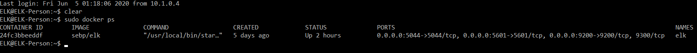

## Automated ELK Stack Deployment

The files in this repository were used to configure the network depicted below.

These files have been tested and used to generate a live ELK deployment on Azure. They can be used to either recreate the entire deployment pictured above. Alternatively, select portions of the filebeat-playbook.yml file may be used to install only certain pieces of it, such as Filebeat.

This document contains the following details:
- Description of the Topology
- Access Policies
- ELK Configuration
  - Beats in Use
  - Machines Being Monitored
- How to Use the Ansible Build

### Description of the Topology

The main purpose of this network is to expose a load-balanced and monitored instance of DVWA, the D*mn Vulnerable Web Application.

Load balancing ensures that the application will be highly available, in addition to restricting access to the network.

Integrating an ELK server allows users to easily monitor the vulnerable VMs for changes to the system logs and system metrics.

Filebeat allows us to collect and parse through logs on our deployed Linux systems.

Metricbeat allows us to monitor our CPU, memory, network, and disk statistics from the host system. In this case, our ELK stack can be used to report on the system metrics of our DVWA box.

The configuration details of each machine may be found below.

| Name       | Function      | IP Address | Operating System |
|------------|---------------|------------|------------------|
| Jump Box   | Gateway       | 10.1.0.4   | Linux            |
| DVWA-VM1   | Application   | 10.1.0.5   | Linux            |
| ELK Person | ELK Stack     | 10.1.0.7   | Linux            |

### Access Policies

The machines on the internal network are not exposed to the public Internet. 

Only the DVWA machine can accept connections from the Internet. Access to this machine is only allowed from the following IP addresses:
Any user can currently access the DVWA machine when it is running.

Machines within the network can only be accessed by whitelisted users.
The current whitelisted users public IP is being used, and allowed over only certain ports that our ELK stack is running.

A summary of the access policies in place can be found in the table below.

| Name       | Publicly Accessible | Allowed IP Addresses               |
|------------|---------------------|------------------------------------|
| Jump Box   | No                  | User's Public IP Address           |
| DVWA-VM1   | Yes                 | Any                                |
| ELK Person | No                  | 10.1.0.4, User's Public IP Address |

### Elk Configuration

Ansible was used to automate configuration of the ELK machine. No configuration was performed manually, which is advantageous because it allows us to quickly and repeatedly deploy our container, ensuring we have a consistent deploy that eliminates most human error that could have been introduced in the process.

The playbook implements the following tasks:
- Installs docker.io
- Installs python-pip
- Installs the docker module using pip
- Increases the virtual memory of our ELK box
- Downloads and launches the sebp/elk container over ports 5601, 9200, and 5044.

The following screenshot displays the result of running `docker ps` after successfully configuring the ELK instance.

### Target Machines & Beats
This ELK server is configured to monitor the following machines:
10.1.0.4

We have installed the following Beats on these machines:
Filebeat
Metricbeat

These Beats allow us to collect the following information from each machine:

Filebeat allows us to collect logs from our linux system which we can use to track any logs we want. By default, it is configured to grab logs from our /var/log folder in our DVWA box here. We can configure it to be a bit more specified if we need to. 

Metricbeat allows us to monitor our host that it is installed on. This lets us monitor things like CPU usage, active services, and other utilities, ensuring we are aware of any issues that may occur or if we need to dedicate more resources to that box.

### Using the Playbook
In order to use the playbook, you will need to have an Ansible control node already configured. Assuming you have such a control node provisioned: 

SSH into the control node and follow the steps below:
- Copy the elk_setup.yml file to /etc/ansible/roles.
- Update the elk_setup.yml file to include your hosts (which host your elk box is on), and your remote user to allow it to install properly on your ELK box.
- Run the playbook using `ansible-playbook elk_setup.yml` , and navigate to the public IP of your ELK box with the port to check that the installation worked as expected. (I.E. XXX.XXX.XXX.XXX:XXXX)